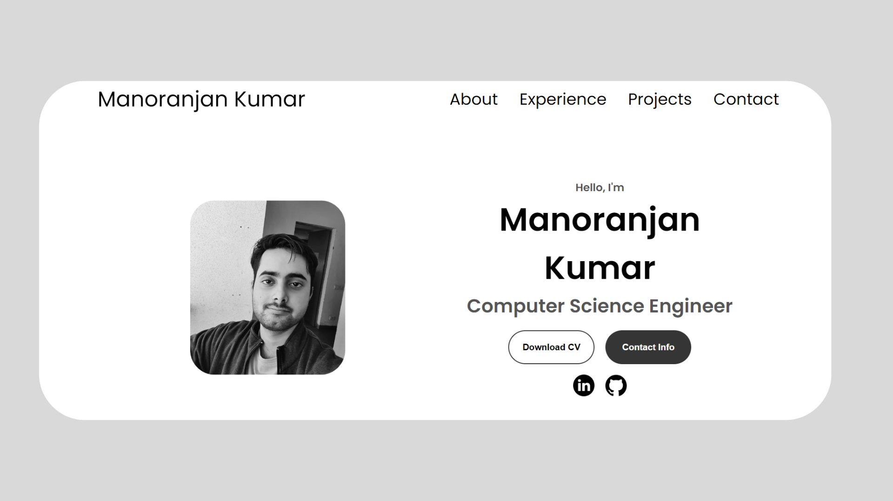

# 🌟 Vista - A Minimalist Online Portfolio

  

**Vista** is a sleek, responsive, and minimalist online portfolio designed to showcase a developer’s educational background, work experience, technical skills, certifications, and projects — all in one place. Built entirely with **HTML**, **CSS**, and **JavaScript**, this portfolio reflects clean design and strong attention to detail, using only black, white, and grey for a timeless and professional look.

## 🌐 Live Preview

[View Portfolio](https://vista99.vercel.app/)

## 🔍 Overview

The portfolio acts as a central hub to present:

- 👨‍🎓 **Education**: Academic history and qualifications.
- 💼 **Experience**: Work and internship roles with insights into responsibilities and contributions.
- 🧠 **Technical Skills**: Categorized knowledge in programming languages, tools, and technologies.
- 🛠️ **SAP Expertise**: Experience with ABAP, Smart Forms, and Dialog Programming.
- ☁️ **ServiceNow Certifications**: Official credentials and areas of expertise in the ServiceNow platform.
- 📁 **Projects**: Highlighted development projects with descriptions and links.
- 📬 **Contact**: Email address and LinkedIn profile for professional networking.

---

## 🎨 Design Philosophy

> *Less is more.*

Vista embraces a minimalistic layout with:

- Monochrome palette (black, white, grey) for an elegant and distraction-free interface
- Clean typography and consistent spacing
- Smooth transitions and user-friendly navigation
- Fully responsive across devices – mobile and desktop

---
